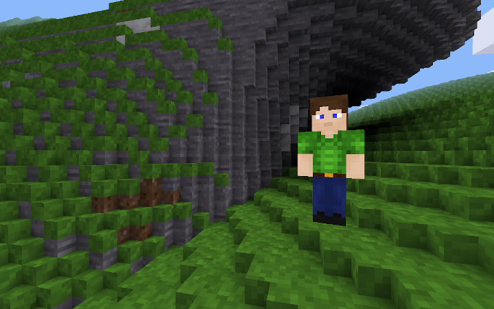

Scaling Demo 4x for Minetest
============================

Based on Aug 31, 2019 commit of minetest_game. Created with the corresponding master branch version of minetest. When used with the stable-5 branch, errors about invalid background elements show up when using the inventory, but it still appears to work. No guarantees though.

**This is a technology demo to give an example of what happens when the player character is scaled up by 4x, which gives the effect of shrinking all the nodes to 1/4th their original size.**

To use this game with Minetest, place this repository in minetest/games directory.

**Notes and Cautions:**

* Must use Creative mode to get reasonable selection distance.

* Must turn off damage—normal jumps at 4x physics cause fall damage.

* Vegetation has been disabled, since most plants are now too small.

* Caves and dungeons have also been disabled, since they're now too small to enter.

* Stairs and walls mods are no longer necessary, so have been deleted.

* The standard door is the only other item that has also been scaled by 4x.

* Basic terrain textures are scaled to maintain the look of the unscaled minetest game. Other textures will likely look too small.

* Mapgen parameters really need to be scaled and tuned to look right at 4x, but my attempts haven't turned out too well.

* No digging aids are currently provided. One could try the digall mod. Note that one original meter block is now 64 blocks, so digging and placing are now very tedious.