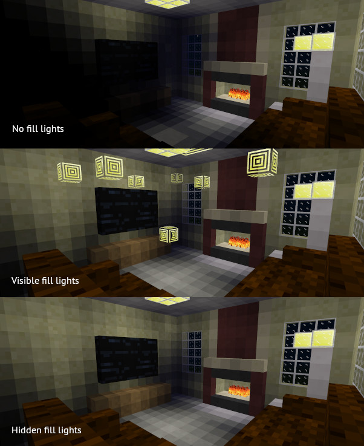

Fill Lights [fill_light]
========================

David_G (kestral246@gmail.com)

Provides full and half brightness invisible fill light nodes to help work around the limited range of Minetest's lamps.

However, to avoid issues with using airlike nodes in inventory, I provide matching visible fill light nodes to allow placing and editing, and two chat commands to swap the nearby fill lights between visible and invisible versions.

To use:

- Requires "fill_lights" priviledge, and checks permissions before swapping nodes.
- Place either fill_light:full (brightness = 14) or fill_light:half (brightness = 9) anywhere extra light is needed.
- Use chat commands /hidefill or /showfill, and then walk around, if necessary, to swap out fill lights. Search range for swap is currently 30 nodes and search time is 60s.

Textures based on minetest game default_meselamp texture.

